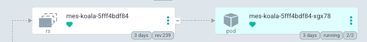

# argo

first go to the koala deployment for uat-b
then look for the revision that has a pod

if you look in the tag in the drone promote

it should match the version in the live manifest
(open manifest by clicking pod and viewing yaml)